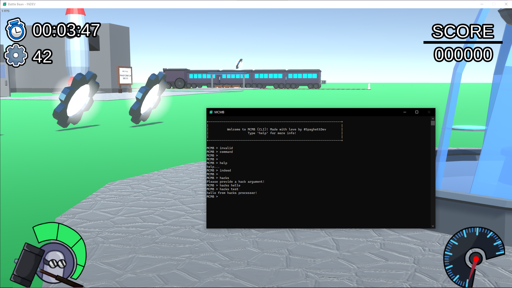

# Mono-CPP-Mod-Base

A C++ mod base for use with C# Unity games built using Mono.

## Installation & Building

1. Run `git clone https://github.com/SpaghettDev/Mono-CPP-Mod-Base.git` in your preferred shell
2. Then run `cd Mono-CPP-Mod-Base`
3. Open `Mono-C++-Mod-Base.sln` in Visual Studio
4. Modify line 76 of `src/dllmain.cpp` with your target's exe name
5. Modify line 19 of `src/Mono/Mono.cpp` with your target's mono dll name
6. Ctrl+Shift+B to build the dll called `Mono-C++-Mod-Base.dll`, will be found in `Mono-CPP-Base/x64/[Release/Debug]`
7. Use an injector to inject into the Unity game!

## Credits

Mostly taken from [this UC thread](https://www.unknowncheats.me/forum/unity/603179-hacking-mono-games.html). With fixes and QOL adjustments by me.

## Image

